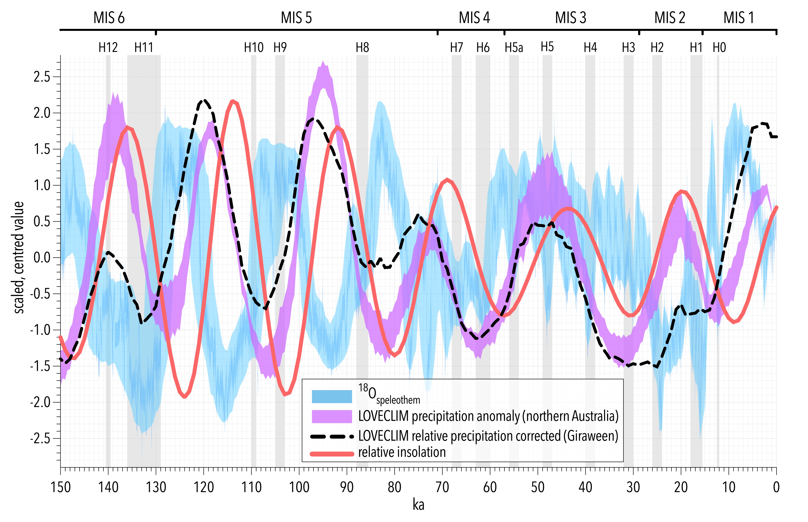

# Indo-Australian Moonsoon record

A continuous, absolute-dated, 150,000-year record of monsoon hydroclimate dynamics from a permanent lagoon in the core monsoon region of northern Australia, compared to global circulation model hindcasts

Contributors: <a href="https://globalecologyflinders.com/people/#CJAB">Corey J. A. Bradshaw</a>, <a href="https://globalecologyflinders.com/people/#FS">Frédérik Saltré</a>, <a href="https://research.jcu.edu.au/portfolio/michael.bird">Michael Bird</a>

## Scripts
- <code>GirraweenMonsoonGithub.R</code>

## Data
- <em>ChSpeleo2.csv</em>: China speleothem record (18O)
- <em>LOVECLIM_NTRegionClimate(1-150ka)_anomalies(Precipitation).csv</em>: LOVECLIM GCM hindcasts of precipitation anomalies for northern Australia
- <em>LOVECLIM_SARegionClimate(1-150ka)_anomalies(Precipitation).csv</em>: LOVECLIM GCM hindcasts of precipitation anomalies for South Asia
- <em>LOVECLIM_Gironly(1-150ka)_anomalies(Precip).csv</em>: LOVECLIM GCM hindcasts of precipitation anomalies for the Girraween cell
- <em>rainLoveClGWdistcor2.csv</em>: distance-to-coast-corrected rainfall at Girraween from LOVECLIM hindcasts
- <em>NTRegionClimate(0-150ka)_anomalies(Precipitation)</em>: HadCM3 GCM hindcasts of precipitation anomalies for northern Australia
- <em>HadCM3_Gironly(0-150ka)_anomalies(Precip).csv</em>: HadCM3 GCM hindcasts of precipitation anomalies for the Girraween cell
- <em>HADCMS rel rainfall.csv</em>: distance-to-coast-corrected rainfall at Girraween from LOVECLIM hindcasts
- <em>rainrel.csv</em>: a test corrected rainfall dataset (redacted)
- <em>Hiso.csv</em>: hydrogen isotope (Girraween core)
- <em>dole2.csv</em>: Dole ΔDE* ‰
- <em>insol.csv</em>: insolation W m-2
- <em>toc.csv</em>: % total organic carbon (Girraween core)
- <em>tree.csv</em>: % tree pollen (Girraween core)

## R libraries
- <code>spatstat</code>, <code>gstat</code>, <code>maps</code>, <code>sp</code>, <code>ape</code>, <code>permute</code>, <code>ggplot2</code>, <code>dplyr</code>, <code>boot</code>
<code>tmvnsim</code>, <code>wCorr</code>, <code>truncnorm</code>, <code>orcutt</code>, <code>lmtest</code>

  &nbsp; &nbsp;
  &nbsp; &nbsp;
   &nbsp; &nbsp; </a>

