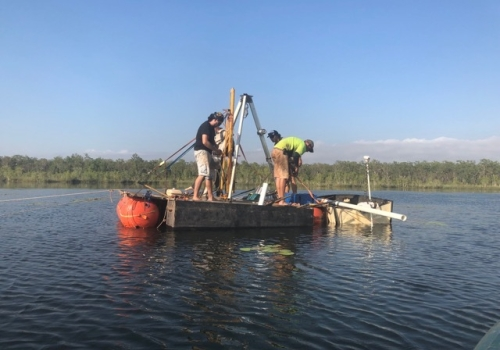

# Indo-Australian Monsoon record

A continuous, absolute-dated, 150,000-year record of monsoon hydroclimate dynamics from a permanent lagoon (<a href="https://doi.org/10.1017/qua.2020.50">Girraween</a>) in the core monsoon region of northern Australia, compared to global circulation model hindcasts

 &nbsp; &nbsp; &nbsp; &nbsp; 

Contributors: <a href="https://globalecologyflinders.com/people/#CJAB">Corey J. A. Bradshaw</a>, <a href="https://globalecologyflinders.com/people/#FS">Frédérik Saltré</a>, <a href="https://research.jcu.edu.au/portfolio/michael.bird">Michael Bird</a>

Accompanies paper: 
 
<a href="https://research.jcu.edu.au/portfolio/michael.bird">Bird, MI</a>, <a href="https://www.linkedin.com/in/michael-brand-a068021aa">M Brand</a>, <a href="https://www.researchgate.net/profile/Rainy-Comley">R Comley</a>, <a href="https://www.researchgate.net/profile/Xennephone-Hadeen-2">X Hadeen</a>, <a href="https://scholars.uow.edu.au/zenobia-jacobs">Z Jacobs</a>, <a href="https://research.jcu.edu.au/portfolio/cassandra.rowe/">C Rowe</a>, <a href="https://www.flinders.edu.au/people/frederik.saltre">F Saltré</a>, <a href="https://research.jcu.edu.au/portfolio/christopher.wurster/">CM Wurster</a>, <a href="https://www.researchgate.net/profile/Costijn-Zwart">C Zwart</a>, <a href="https://www.flinders.edu.au/people/core.bradshaw">CJA Bradshaw</a>. Heinrich events drove major intensification of the Indonesian-Australian monsoon over the last 150,000 years. In review 

and pre-print: 
<a href="https://research.jcu.edu.au/portfolio/michael.bird">Bird, MI</a>, <a href="https://www.linkedin.com/in/michael-brand-a068021aa">M Brand</a>, <a href="https://www.researchgate.net/profile/Rainy-Comley">R Comley</a>, <a href="https://www.researchgate.net/profile/Xennephone-Hadeen-2">X Hadeen</a>, <a href="https://scholars.uow.edu.au/zenobia-jacobs">Z Jacobs</a>, <a href="https://research.jcu.edu.au/portfolio/cassandra.rowe/">C Rowe</a>, <a href="https://www.flinders.edu.au/people/frederik.saltre">F Saltré</a>, <a href="https://research.jcu.edu.au/portfolio/christopher.wurster/">CM Wurster</a>, <a href="https://www.researchgate.net/profile/Costijn-Zwart">C Zwart</a>, <a href="https://www.flinders.edu.au/people/core.bradshaw">CJA Bradshaw</a>. <a href="http://doi.org/10.21203/rs.3.rs-3998035/v1">Heinrich events drove major intensification of the Indonesian-Australian monsoon over the last 150,000 years</a>. <em>Research Square</em> doi:10.21203/rs.3.rs-3998035/v1 

## Abstract
Nearly two thirds of the world’s population depend on monsoon rainfall. Monsoon failure and extreme precipitation have affected societies for millennia. The distribution and amount of monsoon precipitation is predicted to change as the climate warms, albeit with uncertain regional trajectories. Multiple glacial-interglacial terrestrial records of east Asian monsoon variability have been developed, but there are no terrestrial records of equivalent length of the coupled Indo-Australian monsoon at the southern monsoon limit — Australia. Here we present a continuous, absolute-dated, 150,000-year record of monsoon dynamics from a permanent lagoon in the core monsoon region of northern Australia. We show that Australian rainfall is broadly anti-phased with the East Asian monsoon. We identify periods of intense monsoon activity associated with high local insolation in Marine Isotope Stage 5 during ‘megalake’ phases in Australia’s arid interior. We also identify periods of monsoon intensification that are associated with Heinrich events and coincide with weak monsoon events in East Asia. The results suggest that strong asymmetry in inter-hemispheric monsoon rainfall might be one outcome of the current weakening in the strength of the Atlantic meridional overturning circulation. This asymmetry will involve drying in the heavily populated regions north of the equator, and intensification of rainfall in northern Australia.

## <a href="https://github.com/cjabradshaw/IndoAustralianMoonsoon/tree/main/scripts">Scripts</a>
- <a href="https://github.com/cjabradshaw/IndoAustralianMoonsoon/blob/main/scripts/GirraweenMonsoonGithub.R"><code>GirraweenMonsoonGithub.R</code></a>: main code for correlations and plotting
- <a href="https://github.com/cjabradshaw/IndoAustralianMonsoon/blob/main/scripts/Heinrich-tree%20simulation.R"><code>Heinrich-tree simulation.R</code></a>: resampling technique to examine assocation between Heinrich events and %tree pollen

## <a href="https://github.com/cjabradshaw/IndoAustralianMoonsoon/tree/main/data">Data</a>
- <em>ChSpeleo2.csv</em>: China <a href="https://doi.org/10.1029/2011GL050202">speleothem</a> record (18O)
- <em>LOVECLIM_NTRegionClimate(1-150ka)_anomalies(Precipitation).csv</em>: <a href="https://gmd.copernicus.org/articles/3/603/2010/">LOVECLIM</a> global circulation model hindcasts of precipitation anomalies for northern Australia
- <em>LOVECLIM_SARegionClimate(1-150ka)_anomalies(Precipitation).csv</em>: LOVECLIM global circulation model hindcasts of precipitation anomalies for South Asia
- <em>LOVECLIM_Gironly(1-150ka)_anomalies(Precip).csv</em>: LOVECLIM global circulation model hindcasts of precipitation anomalies for the <a href="https://doi.org/10.1017/qua.2020.50">Girraween</a> cell
- <em>rainLoveClGWdistcor2.csv</em>: distance-to-coast-corrected rainfall at Girraween from the LOVECLIM global circulation model hindcasts
- <em>NTRegionClimate(0-150ka)_anomalies(Precipitation)</em>: <a href="https://www.metoffice.gov.uk/research/approach/modelling-systems/unified-model/climate-models/hadcm3">Hadley Centre Coupled Model version 3</a> (HadCM3) global circulation model hindcasts of precipitation anomalies for northern Australia
- <em>HadCM3_Gironly(0-150ka)_anomalies(Precip).csv</em>: Hadley Centre Coupled Model version 3 (HadCM3) global circulation model hindcasts of precipitation anomalies for the <a href="https://doi.org/10.1017/qua.2020.50">Girraween</a> cell
- <em>HADCMS rel rainfall.csv</em>: distance-to-coast-corrected rainfall at Girraween from Hadley Centre Coupled Model version 3 (HadCM3) hindcasts
- <em>rainrel.csv</em>: a test corrected rainfall dataset (redacted)
- <em>Hiso.csv</em>: hydrogen isotope (<a href="https://doi.org/10.1017/qua.2020.50">Girraween</a> core)
- <em>dole2.csv</em>: <a href="https://link.springer.com/referenceworkentry/10.1007/978-1-4020-4411-3_71">Dole effect</a> ΔDE* ‰
- <em>insol.csv</em>: <a href="https://www.sciencedirect.com/topics/earth-and-planetary-sciences/insolation">insolation</a> W m-2
- <em>toc.csv</em>: % total organic carbon (<a href="https://doi.org/10.1017/qua.2020.50">Girraween</a> core)
- <em>tree.csv</em>: % tree pollen (<a href="https://doi.org/10.1017/qua.2020.50">Girraween</a> core)
- <em>d2c.csv</em>: distance to coast (km) through time based on sea-level changes

## R libraries
- <code>spatstat</code>, <code>gstat</code>, <code>maps</code>, <code>sp</code>, <code>ape</code>, <code>permute</code>, <code>ggplot2</code>, <code>dplyr</code>, <code>boot</code>
<code>tmvnsim</code>, <code>wCorr</code>, <code>truncnorm</code>, <code>orcutt</code>, <code>lmtest</code>

  &nbsp; &nbsp;
  &nbsp; &nbsp;
   &nbsp; &nbsp; </a>

